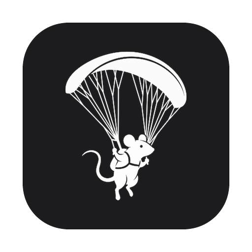
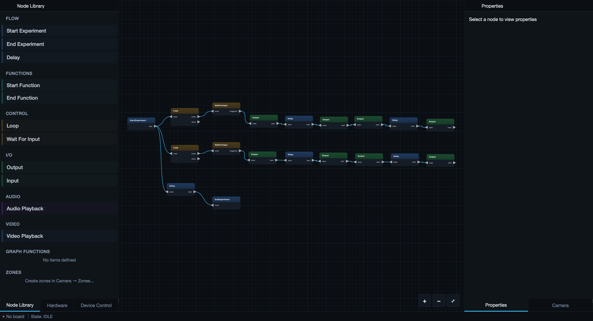

<div align="center">



# GLIDER

**General Laboratory Interface for Design, Experimentation, and Recording**

Build, run, and record laboratory experiments — without writing code.

[](https://lainglab.github.io/GLIDER/)
[](LICENSE)
[](https://www.python.org/)
[](#quick-start)
[](https://github.com/LaingLab/GLIDER/releases)

[**Documentation**](https://lainglab.github.io/GLIDER/) ·
[**Quick start**](#quick-start) ·
[**Contributing**](CONTRIBUTING.md)

</div>

---

GLIDER is a desktop application for building, running, and recording laboratory
experiments. You wire together a **visual node graph** that controls hardware
(Arduino, Raspberry Pi, Bluetooth), reads sensors, records synchronized video and
data, and drives an experiment from start to finish. The same experiment file can
run on a full desktop or on a touchscreen **Runner** — a self-contained kiosk you
can leave at the bench or bolt to a behavior rig.

<div align="center">
  
  <p><em>The Builder: design an experiment as a visual node graph, then press Start.</em></p>
</div>

## Prerequisites

1. [uv](https://docs.astral.sh/uv/getting-started/installation/) — manages the virtual environment and Python for you
   - Windows: `winget install astral-sh.uv`
   - macOS/Linux: `curl -LsSf https://astral.sh/uv/install.sh | sh`
2. FFmpeg (for video recording)
   - Windows: `winget install "FFmpeg (Essentials Build)"`
   - macOS: `brew install ffmpeg`
   - Linux/Raspberry Pi: `sudo apt install ffmpeg`

> GLIDER requires Python 3.11–3.13 (3.14+ is not supported). uv installs a
> compatible Python automatically — no separate Python install needed.

## Quick start

### Windows / macOS / Linux

```bash
git clone https://github.com/LaingLab/GLIDER.git
cd GLIDER
uv venv
uv sync --extra pc
uv run glider
```

### Raspberry Pi

PyQt6 comes from apt on the Pi (it is intentionally not a core dependency),
so the venv must be created with access to system packages:

```bash
sudo apt install python3-pyqt6
git clone https://github.com/LaingLab/GLIDER.git
cd GLIDER
uv venv --system-site-packages
uv sync --extra rpi --extra i2c
uv run glider
```

## Optional extras

Add any of these to the sync command with additional `--extra` flags,
e.g. `uv sync --extra pc --extra vision`:

| Extra      | What it adds                                                  |
| ---------- | ------------------------------------------------------------- |
| `pc`       | PyQt6 + audio — the standard desktop install                  |
| `rpi`      | Raspberry Pi GPIO (gpiozero, lgpio)                           |
| `vision`   | YOLO tracking (ultralytics)                                   |
| `audio`    | Audio recording/playback                                      |
| `i2c`      | I2C devices (ADS1x15, smbus2) — Linux/Pi only at runtime      |
| `behavior` | Behavior analysis (UMAP, HDBSCAN, scikit-learn, LightGBM)     |
| `dev`      | Test/lint tooling plus the full pc+vision+i2c+behavior stack  |

## Documentation

Full guides live at **[lainglab.github.io/GLIDER](https://lainglab.github.io/GLIDER/)**:

| Guide | What it covers |
| ----- | -------------- |
| [Getting Started](https://lainglab.github.io/GLIDER/getting-started/) | Install GLIDER and build your first experiment |
| [Building Experiments](https://lainglab.github.io/GLIDER/building/) | The node graph, wiring devices, packaging routines |
| [Camera & Behavior](https://lainglab.github.io/GLIDER/camera-behavior/) | Cameras, synchronized recording, tracking, analysis |
| [Runner Mode](https://lainglab.github.io/GLIDER/runner/) | Operating experiments from a touchscreen or Pi kiosk |

## Development

```bash
uv sync --extra dev

# Tests (Qt needs a virtual display when headless)
QT_QPA_PLATFORM=offscreen uv run pytest tests/

# Lint & format
uv run ruff check .
uv run black .
```

## Citation

If you use GLIDER in your research, please cite it:

```bibtex
@software{glider,
  title  = {GLIDER: General Laboratory Interface for Design, Experimentation, and Recording},
  author = {Laing Lab},
  year   = {2026},
  url    = {https://github.com/LaingLab/GLIDER}
}
```

## Contributing

Issues and pull requests are welcome — see [CONTRIBUTING.md](CONTRIBUTING.md)
for development setup, coding standards, and the review process.

## License

Released under the [MIT License](LICENSE). Copyright © 2026 Laing Lab.
