<p align="center">
  
</p>

<h1 align="center">GLIDER</h1>

<p align="center">
  <b>G</b>eneral <b>L</b>aboratory <b>I</b>nterface for
  <b>D</b>esign, <b>E</b>xperimentation, and <b>R</b>ecording
</p>

<p align="center">
  Laboratory automation driven from a visual, node-based flow editor —
  hardware control, camera tracking, and behavior analysis in one place.
</p>

#### Documentation Coming Soon...

## Prerequisites

1. [uv](https://docs.astral.sh/uv/getting-started/installation/) — manages the virtual environment and Python for you
   - Windows: `winget install astral-sh.uv`
   - macOS/Linux: `curl -LsSf https://astral.sh/uv/install.sh | sh`
2. FFmpeg (for video recording)
   - Windows: `winget install "FFmpeg (Essentials Build)"`
   - macOS: `brew install ffmpeg`
   - Linux/Raspberry Pi: `sudo apt install ffmpeg`

> GLIDER requires Python 3.11–3.13 (3.14+ is not supported). uv installs a
> compatible Python automatically — no separate Python install needed.

## Getting Started

### Windows / macOS / Linux

```bash
git clone https://github.com/LaingLab/glider.git
cd glider
uv venv
uv sync --extra pc
uv run glider
```

### Raspberry Pi

PyQt6 comes from apt on the Pi (it is intentionally not a core dependency),
so the venv must be created with access to system packages:

```bash
sudo apt install python3-pyqt6
git clone https://github.com/LaingLab/glider.git
cd glider
uv venv --system-site-packages
uv sync --extra rpi --extra i2c
uv run glider
```

## Optional Extras

Add any of these to the sync command with additional `--extra` flags,
e.g. `uv sync --extra pc --extra vision`:

| Extra      | What it adds                                                  |
| ---------- | ------------------------------------------------------------- |
| `pc`       | PyQt6 + audio — the standard desktop install                  |
| `rpi`      | Raspberry Pi GPIO (gpiozero, lgpio)                           |
| `vision`   | YOLO tracking (ultralytics)                                   |
| `audio`    | Audio recording/playback                                      |
| `i2c`      | I2C devices (ADS1x15, smbus2) — Linux/Pi only at runtime      |
| `behavior` | Behavior analysis (UMAP, HDBSCAN, scikit-learn, LightGBM)     |
| `dev`      | Test/lint tooling plus the full pc+vision+i2c+behavior stack  |

## Development

```bash
uv sync --extra dev

# Tests (Qt needs a virtual display when headless)
QT_QPA_PLATFORM=offscreen uv run pytest tests/

# Lint & format
uv run ruff check .
uv run black .
```
