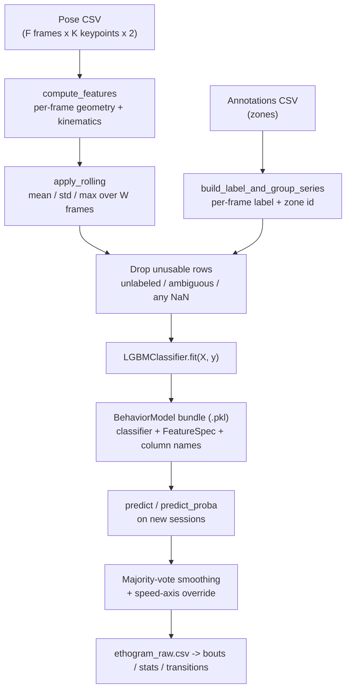

# How the LightGBM Behavior Classifier Works

This page explains exactly what GLIDER does when you press **Fit** on the Behavior
Analysis **Train** tab, and what happens to a frame of video when you press **Run**
on the **Apply** tab. It is the mechanical companion to the workflow guide in
[Behavior Analysis](../camera-behavior/behavior.md).

The short version: GLIDER never shows LightGBM a video, or a pose, or a frame. It
shows it a **table of numbers** — one row per frame, a few hundred columns of
geometry and motion summarized over a one-second window — and asks it to put each
row in a bucket. Everything interesting is in how that table is built and what is
thrown away before the model ever sees it.

## The pipeline end to end



Source: [`pipeline.py`](https://github.com/LaingLab/glider/blob/main/src/glider/analysis/behavior/pipeline.py)
orchestrates the training half; [`classify/`](https://github.com/LaingLab/glider/blob/main/src/glider/analysis/behavior/classify/)
orchestrates the apply half.

---

## Step 1 — Pose becomes per-frame numbers

`compute_features()` (`src/glider/analysis/behavior/features.py::compute_features`) turns a
`(F, K, 2)` array of keypoint coordinates into a `(F, n_features)` DataFrame. For
**K** keypoints it emits:

| Feature family | Count | What one column means |
| --- | --- | --- |
| `body_length` | 1 | Pixel distance between the two `body_axis` keypoints (snout ↔ tail-base by default) |
| `dist_<a>_<b>` | K(K−1)/2 | Distance between two keypoints, **divided by that frame's body length** |
| `angle_<a>_at_<b>_<c>` | K(K−1)(K−2)/2 | Interior angle at vertex `b`, in radians |
| `speed_<kp>` | K | Velocity magnitude, in body-lengths per frame |
| `accel_<kp>` | K | Acceleration magnitude, in body-lengths per frame² |
| `body_angular_velocity` | 1 | Turn rate of the body axis, radians per frame |

For a typical 7-keypoint mouse skeleton that is **142 per-frame columns** (1 + 21 +
105 + 7 + 7 + 1).

Three properties of this stage matter more than the feature list itself:

**Everything is divided by body length.** That is what makes a big mouse and a
small mouse produce the same numbers for the same behavior, and it is why the
model transfers across animals at all. Velocities use `np.gradient`, so interior
frames get *centered* differences — a fact the live path has to reproduce exactly
(see [Step 6](#step-6-inference)).

**`body_length` is the one exception.** It is emitted in raw pixels, so it encodes
camera height and resolution, not just the animal. It is usually among the
most-split-on features, which makes it a genuine cross-session leak — GLIDER ships
a dedicated guard for it ([the scale check](#the-scale-check-lightgbm-only)). Set
`FeatureSpec.include_body_length=False` to drop the column and make the whole
feature set scale-invariant.

**Missing keypoints produce NaN, not zeros.** A low-confidence keypoint NaNs every
feature that depends on it. Nothing is imputed at any later stage.

## Step 2 — Frames become windows

A single frame cannot distinguish *grooming* from *resting* — behavior lives in a
span of time. `apply_rolling()` (`windowing.py::apply_rolling`) replaces each per-frame column
with one column per rolling statistic:

```
body_length__mean, dist_snout_left_ear__mean, …   (142 columns)
body_length__std,  dist_snout_left_ear__std,  …   (142 columns)
body_length__max,  dist_snout_left_ear__max,  …   (142 columns)
```

At the default `window=30`, `stats=("mean","std","max")` and 7 keypoints, the
design matrix handed to LightGBM is **426 columns wide**, each row summarizing one
second of 30 fps video.

`min_periods` defaults to the full window, so the first 29 rows of every session
come out NaN and are dropped rather than being estimated from a partial window.
Sessions are rolled **independently and then concatenated** — otherwise session
N's opening window would average in the tail of session N−1.

!!! note "These columns are heavily correlated by construction"
    `dist_snout_neck__mean` and `dist_snout_neck__max` measure nearly the same
    thing. That redundancy is exactly why the defaults sample only 80% of features
    per tree (`feature_fraction`) — decorrelating the trees is worth more here
    than it would be on an independent feature set.

## Step 3 — Annotations become labels

`build_label_and_group_series()` (`labels.py::build_label_and_group_series`) projects your annotation zones
onto a per-frame vector, and emits a second vector of **zone group IDs**. Each
frame ends up as one of:

| Value | Meaning | Fate |
| --- | --- | --- |
| `""` | No zone covers this frame | Dropped (or promoted to `background`) |
| `"<behavior>"` | Annotated | Kept |
| `"__ambiguous__"` | Two zones of *different* behaviors overlap, **or** the clip was marked `multi-behavior` / `unclear` | Always dropped |

The group IDs exist for one reason: adjacent windows overlap by 29/30 frames and
are therefore near-duplicates. Splitting them randomly would put near-identical
rows on both sides of a train/test boundary and inflate the test score. GLIDER
feeds group IDs to `GroupShuffleSplit`/`GroupKFold` so every row from one labeled
zone lands on the same side.

## Step 4 — Rows are dropped

`_assemble_and_filter()` (`pipeline.py::_assemble_and_filter`) applies one mask:

```python
keep_mask = (y != "") & (y != AMBIGUOUS) & ~X.isna().any(axis=1)
```

**Any row with a single NaN cell anywhere in 426 columns is discarded.** This is
worth internalizing: LightGBM has excellent native missing-value handling, and
GLIDER never exercises it. One dropped keypoint on one frame removes that frame,
and (via the rolling window) degrades the 29 rows after it.

With `include_background=True`, unlabeled frames are relabeled `background` *before*
this mask, then subsampled to at most `background_subsample_ratio` × the largest
real class (default 5×) — without that cap, background outnumbers labels ~100:1 on
a full recording and the model learns "always predict background."

## Step 5 — The classifier is constructed and fit

Everything above is backend-agnostic. This is the only place LightGBM appears
(`pipeline.py::_build_classifier`):

```python
from lightgbm import LGBMClassifier

LGBMClassifier(
    n_estimators=n_estimators,          # default 200
    random_state=random_state,          # default 42
    n_jobs=-1,
    class_weight=class_weight,          # None or "balanced"
    num_leaves=reg.num_leaves,          # 31
    min_child_samples=reg.min_child_samples,   # 50
    colsample_bytree=reg.feature_fraction,     # 0.8
    subsample=reg.bagging_fraction,            # 0.8
    subsample_freq=1 if reg.bagging_fraction < 1.0 else 0,
    reg_lambda=reg.reg_lambda,          # 1.0
    learning_rate=reg.learning_rate,    # 0.1
    max_depth=reg.max_depth,            # -1 (unlimited)
    min_split_gain=reg.min_split_gain,  # 0.0
    verbosity=-1,
)
```

Then one line does the actual learning:

```python
clf.fit(x_train, y_train)
```

No scaler, no imputer, no pipeline, no early stopping, no eval set. Trees split on
thresholds, so feature scaling would be pointless; every boosting round you ask for
is run.

### What LightGBM does with that table

LightGBM is a **gradient-boosted decision tree ensemble**. Four mechanics explain
essentially all of its behavior here:

**Histogram binning.** Each of the 426 float columns is bucketed into at most 255
bins before training. Splits are chosen among bin edges, not raw values — which is
why the model records a finite, inspectable set of thresholds per feature (the
scale check reads exactly these).

**Leaf-wise growth.** Where a Random Forest grows trees level by level, LightGBM
repeatedly splits whichever *leaf* promises the largest loss reduction. That is
why `num_leaves` — not depth — is the real capacity dial, and why `max_depth=-1`
(unlimited) is a sane default: leaf count is already the binding constraint.

**Sequential boosting.** Round *t*'s tree is fit to the residual error left by
rounds 1…*t*−1, each scaled by `learning_rate`. Trees are corrective, not
independent voters — this is the structural difference from the `rf` backend, and
the reason a lower learning rate plus more rounds generalizes better than the
reverse.

**One tree per class per round.** With ≥3 behaviors, LightGBM selects the
`multiclass` (softmax) objective automatically and grows one tree per class per
round. 200 rounds × 5 behaviors = **1,000 trees**, each up to 31 leaves.
`predict_proba` softmaxes the per-class scores, so rows sum to 1.

### The defaults are deliberately tighter than stock LightGBM

`LgbmReg` (`pipeline.py::LgbmReg`) ships mildly regularized defaults, because the
failure mode in this domain is not underfitting — it is a model that scores 100%
on your training sessions and 60% on a new mouse.

| Knob | GLIDER | Stock | Why the change |
| --- | --- | --- | --- |
| `min_child_samples` | **50** | 20 | A leaf covering 20 frames is 0.7 s of one animal — memorizable |
| `feature_fraction` | **0.8** | 1.0 | Windowed columns overlap heavily; decorrelate the trees |
| `bagging_fraction` | **0.8** | 1.0 | Row subsampling adds between-tree variance |
| `reg_lambda` | **1.0** | 0.0 | Shrinks confident leaves toward the mean |
| `num_leaves`, `learning_rate`, `max_depth`, `min_split_gain` | 31 / 0.1 / −1 / 0.0 | same | Left at stock so existing models reproduce |

All nine are exposed in the GUI under **Train ▸ Advanced…** (`gui/behavior/window.py::LgbmAdvancedDialog`),
which is enabled only for the `lightgbm` backend — the Random Forest path ignores
every one of them.

!!! warning "`min_child_samples=50` interacts badly with tiny classes"
    A behavior with fewer than ~50 labeled frames cannot get a leaf of its own, so
    the model may never predict it at all. If a class is missing from the summary's
    predictions, check its frame count before reaching for other knobs.

### Reproducibility

`random_state` (default 42) seeds row and feature subsampling and the train/test
split. GLIDER does not set LightGBM's `deterministic` parameter, so a refit on the
same data in the same environment reproduces, but bitwise-identical trees across
different thread counts or LightGBM versions are not guaranteed.

## Step 6 — Inference

The trained classifier is saved with everything needed to rebuild its input:
the fitted booster, the `FeatureSpec`, the **exact ordered column names**, the
window length, the stat list, and the training fps — one joblib pickle,
`format_version: 2` (`model.py::BehaviorModel.save`).

At predict time (`model.py::BehaviorModel.predict`):

1. Columns are reordered by name to `feature_names` — a reordering upstream cannot
   silently shift values into the wrong feature.
2. Rows with any NaN are marked and emitted as `""` — **never** sent to the model.
   A partially known row is not a weak prediction; it is no prediction.
3. Without a threshold: `classifier.predict(df)` → argmax class.
4. With `confidence_threshold` or per-class `class_thresholds`: `predict_proba`,
   then `_threshold_decision` — the highest-probability class that clears *its own*
   threshold fires, and if none clear theirs the row emits `""`. This is how you get
   a meaningful "unknown" from a model trained without a background class.

Two code paths call this, and they are required to agree row for row:

| Path | Used by | How |
| --- | --- | --- |
| **Batch** (`classify/batch.py`) | Apply tab on recorded video | Whole-session `compute_features` → `apply_rolling` → one vectorized `predict` |
| **Streaming** (`classify/threads.py`) | Live camera | 5-frame keypoint ring → `SlidingFeatureBuffer` → `predict_one` per tick |

The batch path exists purely for speed — its module docstring notes that per-row
predicts are dominated by building a one-row DataFrame, and that LightGBM's thread
pool spins uselessly on single rows while starving the decode threads it shares a
machine with. To stay a drop-in replacement it reproduces the streaming path's
quirks exactly: `min_periods=1` on the rolling stats, rows tagged with the *middle*
frame of the 5-frame centered-gradient window, `ddof=1` on the standard deviation
(matching pandas), and the same blank-on-NaN rule.

After prediction, labels pass through a `MajorityVoteSmoother` (with hysteresis on
ties), and a thresholded **speed axis** overrides the postural label wherever it
fires — freezing and darting are direct measurements of displacement, and beat a
classifier's guess about posture (`classify/batch.py::resolve_labels`).

## The hybrid model

`train_hybrid_model()` (`pipeline.py::train_hybrid_model`) wraps a LightGBM base in a
`HybridModel` that blends the model's posterior with a hand-built kinematic prior
in log space:

```
log P_final = (1 − λ) · log P_model + λ · log P_prior
```

The prior (`prior.py`) is unsupervised: it reads mean keypoint speed per row,
calibrates freeze/dart thresholds as percentiles of the session's own speed
distribution, and grades classes up or down through semantic tags
(`stationary`, `locomotory`) rather than by name — so the same rules transfer across
vocabularies.

λ is tuned honestly: the validation split is carved out **before** the λ-selection
base is fit, λ is grid-searched 0.0–1.0 by validation macro-F1, ties resolve to the
smaller λ (so λ=0 wins on no improvement), and only then is the shipped base refit
on all kept rows. **LightGBM is hard-required here** — no Random Forest fallback
(`train_hybrid_model` passes `require=True` to `_build_classifier`).

## Reading the training summary

`TrainResult.summary` (surfaced in the GUI results box and written to
`summary.json` by `report.py`) carries per-class counts, train/test accuracy,
per-class precision/recall/F1, the confusion matrix, the split strategy, and the
top 20 features by importance.

!!! warning "`top_features` means something different on LightGBM than on Random Forest"
    `LGBMClassifier.feature_importances_` defaults to `importance_type="split"` —
    **how many times a feature was split on**, not how much impurity it removed.
    A feature split often but shallowly can outrank one split once at the root. Read
    the list as "what the model kept consulting," not "what mattered most."

Train accuracy alone is not evidence of anything. Use either:

- **`holdout_sessions`** — train on some recordings, test on others. The split
  strategy is recorded as `cross_session`.
- **`cross_validate_sessions()`** (`pipeline.py::cross_validate_sessions`) — `GroupKFold` over *whole
  sessions*, so every fold's test rows come from recordings the model never saw.
  Mirror-augmented copies stay with their parent session and are used for training
  only; scoring is always on un-mirrored rows.

## Things that only work because the backend is LightGBM

### The scale check (LightGBM-only)

`scale_guard.py` opens the trained booster with `booster_.dump_model()`, walks
every tree, and collects each threshold the model learned to split `body_length__*`
on. It then asks where the current session's animal sits among those thresholds. If
it is below 5% or above 95% of them, every tree takes the same branch on every
frame — the feature has quietly become a constant, and the labels will look
plausible and be wrong.

This works only because a gradient-boosted tree ensemble exposes its splits.
`body_length_splits()` returns `None` when the classifier has no `booster_`, so
**Random Forest models silently skip this check entirely.**

### Backend fallback and its one exception

If `lightgbm` is not installed, `_build_classifier` warns and falls back to
`RandomForestClassifier` — except in the hybrid path, which passes `require=True`
and raises `RuntimeError` instead. Check `summary["classifier_type"]` to see which
backend actually ran.

!!! warning "LightGBM's version is not recorded in the bundle"
    `capture_library_versions()` (`model.py::capture_library_versions`) records numpy, pandas, scipy,
    sklearn, and joblib, and the loader warns on major.minor drift in any of them.
    `lightgbm` is **not** in that list, even though it is the library that pickled
    the booster. A LightGBM major-version change between training and loading will
    not produce a warning here.

## Source map

| Concern | File |
| --- | --- |
| Per-frame features + `FeatureSpec` | `src/glider/analysis/behavior/features.py` |
| Rolling window statistics | `src/glider/analysis/behavior/windowing.py` |
| Zones → per-frame labels + groups | `src/glider/analysis/behavior/labels.py` |
| Training orchestration, `LgbmReg`, `_build_classifier` | `src/glider/analysis/behavior/pipeline.py` |
| Bundle save/load, `predict`, thresholding | `src/glider/analysis/behavior/model.py` |
| Hybrid blend | `src/glider/analysis/behavior/hybrid.py` |
| Kinematic prior | `src/glider/analysis/behavior/prior.py` |
| Body-length / calibration guards | `src/glider/analysis/behavior/scale_guard.py` |
| Batch (recorded-video) apply | `src/glider/analysis/behavior/classify/batch.py` |
| Streaming (live) apply | `src/glider/analysis/behavior/classify/threads.py`, `classify/buffer.py` |
| GUI knobs | `src/glider/gui/behavior/window.py` |

## Next steps

- The workflow these internals serve: [Behavior Analysis](../camera-behavior/behavior.md).
- Producing the pose data everything starts from: [Tracking](../camera-behavior/tracking.md).
- System-wide context: [GLIDER Ecosystem Reference](ecosystem-reference.md).
