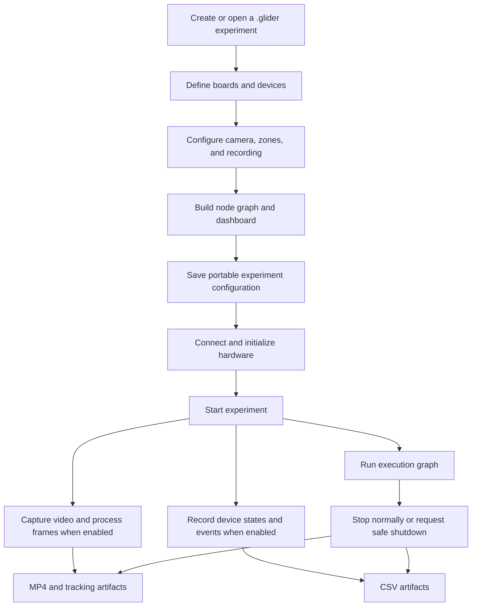
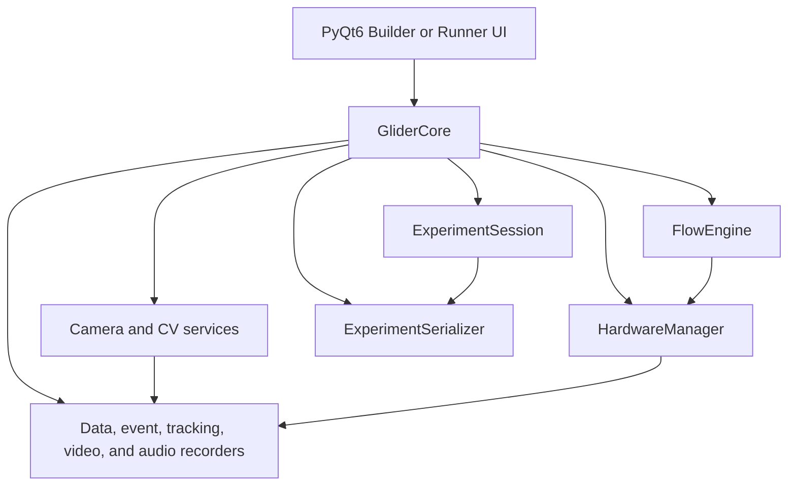

# GLIDER Ecosystem Reference

GLIDER is a cross-platform laboratory-automation application for designing, running, recording, and reviewing behavioral experiments without requiring users to write the experiment logic as code. This reference is a reviewer-facing companion to the user guides: it explains what GLIDER is, what each subsystem is responsible for, what an experiment produces, and which claims should be made with appropriate scope.

**Audience:** laboratory scientists, collaborators, reviewers, and technically literate contributors who need a durable mental model of the current system.

**Code baseline:** this document describes the repository's `main` branch at the time of writing. The package currently identifies itself as `0.3.0-dev`; installed releases and laboratory deployments may differ.

## GLIDER in one page

GLIDER addresses a practical coordination problem. A behavioral experiment often needs a reproducible protocol, hardware control, camera capture, and analysis-ready records at the same time. GLIDER keeps those concerns in one saved experiment and presents them through a visual graph rather than an imperative script.

- **Design:** define boards and devices, configure camera and zones, and assemble a node graph in Builder mode.
- **Operate:** run that same saved experiment in a desktop workspace or a touch-first Runner interface.
- **Record:** write video, frame-aligned device-state data, edge/event logs, and tracking records to a selected recording directory.
- **Analyze:** perform live tracking, offline video tracking, and supervised behavior classification from annotated pose data.
- **Extend:** add devices without code through a declarative builder, or add Python board/device/node plugins through documented extension points.

GLIDER is not a replacement for all real-time systems. It is designed around practical behavioral rigs and commodity hardware. Workloads that require deterministic sub-millisecond control, very high acquisition rates, or large multi-camera inference loads should be characterized on the intended hardware and may need a dedicated acquisition system.

## The experiment lifecycle

An experiment is a `.glider` JSON file plus the recorded artifacts created when it runs. The saved file is the portable protocol; the recording directory holds the evidence produced by a particular execution.

_Scope: the normal path from experiment design through recorded output. It omits optional plugins and offline behavior-model training._

The file captures metadata, hardware definitions, flow configuration, camera and zone settings, and dashboard layout. A recording uses a shared session epoch so that device, event, and tracking data can be related in time. When computer vision and a camera are active, device-state recording can be camera-driven, producing rows aligned to processed frames; otherwise it uses a periodic sampling loop.

## What users see: Builder and Runner

### Builder is the experiment-authoring workspace

Builder mode is the full desktop interface. It provides the graph canvas, node library, hardware configuration, camera controls, device panels, and properties editors. Researchers use it to create a reproducible protocol before taking it to a rig.

The graph has two connection types:

- **Execution wires** carry the next-action signal. A run begins at `StartExperiment` and normally reaches `EndExperiment`.
- **Data wires** carry values such as sensor readings, thresholds, calculated values, or node settings.

This distinction matters in explanations of GLIDER: data flow alone does not trigger an experiment action. The execution graph supplies ordering, while data connections supply the values used by that ordering.

### Runner is the touch-first operating workspace

Runner is intended for an operator at a bench or a Raspberry Pi touchscreen. It can load the same `.glider` file but uses larger controls and a four-tab structure:

- **Setup** loads/saves experiments and connects hardware.
- **Run** starts and stops a ready experiment and shows run state.
- **Manual** generates controls from a device's declared actions and ranges.
- **Camera** provides the camera and recording interface.

Runner does not create a separate kind of experiment. It is another view over the same experiment session and hardware model. Manual functions are deliberately prevented from overlapping an active experiment because both could drive the same hardware.

## Architecture: how GLIDER coordinates the subsystems

`GliderCore` is the application-level coordinator. It owns the current experiment session and connects the flow engine, hardware manager, camera and recording components, serializers, and application-facing callbacks.

_Scope: the principal runtime ownership model. The chart shows responsibility boundaries, not every callback or thread._

### Concurrency model

GLIDER combines a Qt user interface with an asyncio event loop through `qasync`. It does not claim that every operation runs on one main-thread loop.

- Camera capture runs in a background Python thread.
- Live CV processing is dispatched to a dedicated Qt worker thread; the UI receives results through signals.
- Batch video tracking runs through a worker thread so it does not block the GUI.
- Telemetrix communication is isolated in a dedicated thread with its own event loop.
- Raspberry Pi GPIO and other blocking hardware operations are moved through `asyncio.to_thread` where required.

This design keeps slow I/O and model work from directly freezing the interface. It does not remove the need to benchmark a particular camera, model, board, and machine combination.

## The saved experiment: session, metadata, and portability

`ExperimentSession` is the in-memory representation of the experiment. It stores the protocol rather than a raw recording. The important configuration domains are:

- **Metadata:** experiment name, author, protocol, experiment type, experimenter, lab, project, notes, and subjects.
- **Hardware:** board definitions, logical devices, and device settings.
- **Flow:** node definitions, positions, state, bindings, and connections.
- **Camera and vision:** source settings, calibration, zones, tracking settings, and recording choices.
- **Dashboard:** layout and controls used by the Runner-facing interface.

The serializer validates and writes this structure as a `.glider` file. A saved file can be moved between machines, but successful execution still depends on the target machine having the needed drivers, optional dependencies, hardware access, compatible pin assignments, and any external model files.

## Hardware model: boards, devices, actions, and safety

GLIDER distinguishes the controller from the logical component attached to it.

- A **board** owns a connection and exposes physical capabilities such as digital, analog, PWM, and servo operations.
- A **device** represents a meaningful laboratory component, such as a relay, sensor, servo, stepper driver, ADC, or BLE characteristic.
- A **node** binds to a device and invokes an action without needing to know the board-specific implementation.

This separation lets a graph express "turn the house light on" or "read the lick sensor" rather than embed a pin number in every graph node.

### Built-in board and transport support

The Python package registers built-in drivers for the following transport categories:

| Driver category | Typical use | Important condition |
| --- | --- | --- |
| Arduino / Telemetrix | USB-connected Arduino-class board | The board needs compatible Telemetrix firmware and a usable serial connection. |
| Raspberry Pi GPIO | Direct GPIO control on a Pi | Requires the Pi-specific optional dependencies and appropriate OS permissions. |
| Bluetooth Low Energy | BLE peripheral communication | Requires a reachable peripheral and its address/characteristic configuration. |
| Serial | Generic serial transport | Supports serial-connected devices where the selected device implementation applies. |
| I2C / SPI devices | Bus-attached devices, primarily on Linux/Pi environments | These are optional, platform-dependent paths. |

The user documentation emphasizes Arduino, Raspberry Pi, and BLE because they are the primary interactive board choices. It is more accurate to describe GLIDER as supporting these built-in paths than to claim universal compatibility with any hardware attached to any board.

### Built-in devices and declarative custom devices

Built-in device types include digital and analog inputs, digital and PWM outputs, servos, a motor governor, A4988 steppers, ADS1115 ADCs, generic I2C devices, BLE write devices, serial devices, and selected transport-specific devices.

The Custom Device builder covers straightforward GPIO and I2C cases without requiring Python. A user defines a transport, operations, action names, and allowed value ranges. GLIDER then exposes the device through the same generic device-action model used by built-in devices.

### Value ranges and safe shutdown

Each device action may declare a value specification: minimum, maximum, step, unit, or a boolean/no-value behavior. The properties panel, Runner controls, and action execution use that shared specification. Out-of-range numeric values are clamped; invalid non-finite values are rejected.

The hardware manager also provides disconnect and emergency-stop paths. Safe shutdown attempts to stop devices and boards while preserving errors for reporting. The exact safe state depends on what each board and device implementation defines.

## The flow engine and node system

The flow engine uses `ryvencore` when available and otherwise has a limited standalone path. GLIDER registers its node classes with a central registry, reconstructs them from saved session data, binds hardware nodes to devices, and schedules execution propagation with asyncio tasks.

### Core experiment controls

Common graph nodes include:

- **StartExperiment / EndExperiment:** define the start and normal end of a run.
- **Delay, Loop, Sequence, and Timer:** supply temporal and control-flow structure.
- **WaitForInput:** waits for a device condition, threshold, or supported custom behavior.
- **StartFunction, EndFunction, and FunctionCall:** package and reuse named action sequences.

### Hardware, interface, and logic nodes

The catalog also includes generic Input, Output, Device Action, and Device Read nodes; digital/analog/PWM variants; audio and video playback; zone input; interface controls; and math, comparison, mapping, threshold, toggle, and PID nodes. The visible palette is intentionally smaller than the full set of node types that can be loaded from saved experiments.

When explaining a protocol, distinguish the generic `Output` and `Input` nodes from device-specific behavior. The node is reusable; its behavior derives from the device it is bound to.

## Camera, recording, and tracking

### Camera acquisition and recording

GLIDER manages live camera sources, including OpenCV capture and platform-specific fallbacks. It can record a primary camera or multiple cameras, subject to the selected hardware and configuration. Video output uses MP4-capable writer paths; audio can be recorded separately and may be muxed when FFmpeg is available.

The normal recording products can include:

| Artifact | Purpose |
| --- | --- |
| `<experiment>_<timestamp>.csv` | Device-state samples with metadata headers. |
| `<experiment>_<timestamp>_events.csv` | Device-output changes and input-edge or callback events. |
| `<experiment>_<timestamp>_tracking.csv` | Per-frame tracking and zone-related data. |
| `<experiment>_<timestamp>.mp4` | Raw video where video recording is enabled. |
| `<experiment>_<timestamp>_annotated.mp4` | Overlay video when annotated recording is enabled. |
| Audio artifacts | Separate audio or muxed audio/video, depending on configuration and FFmpeg availability. |

CSV files carry metadata rows before their tabular header. The analysis package can discover and load a recording directory, then join the available data, event, tracking, and video artifacts for downstream analysis.

### Live tracking

The vision system provides model-free background subtraction and motion-only modes, plus Ultralytics YOLO and YOLO-with-ByteTrack modes when the optional vision stack is installed. ByteTrack supplies persistent object IDs when its optional `lap` dependency is available; without it, the system degrades to plain YOLO detection rather than silently claiming stable tracks.

YOLO pose models can supply keypoints. GLIDER stores operator-supplied keypoint names with the settings because a model's class names are not a reliable body-part vocabulary. GLIDER can run `.pt` models on the best available PyTorch device, preferring CUDA and then Apple MPS. It can also load an Ultralytics NCNN export; NCNN is treated as a CPU backend and relies on an exported model directory with metadata.

Zones are user-drawn regions within the camera view. The CV processor determines occupancy and forwards zone state to zone nodes and recorders. A zone can therefore become a graph input, such as triggering an output when an animal enters a defined region.

### Offline video tracking

The Camera panel can process a recorded video without a live camera. The batch runner uses the video timeline rather than wall-clock processing time. Its output directory can contain a tracking CSV, zone enter/exit events, zone occupancy totals, an annotated MP4, and a `metadata.json` record of source and processing settings.

## Behavior analysis: annotation, training, and application

GLIDER has two distinct behavior features that should not be conflated.

### Live movement-state labels

The camera settings support a light-weight, rule-based live state classifier. It uses movement thresholds to label tracked objects as states such as freezing, immobile, moving, or darting. These labels are useful for immediate feedback and are stored in tracking output when enabled. They are not a trained model for complex behavior categories.

### Supervised behavior workflow

The Behavior Analysis tool is an optional workflow built around pose data. It proceeds in three stages:

1. **Annotate:** create a vocabulary and label selected video clips. Labels are saved alongside pose data.
2. **Train:** derive geometric and kinematic features from pose, summarize them over windows, and fit a Random Forest or LightGBM classifier. Whole sessions can be held out for a more credible generalization test.
3. **Apply:** combine a trained model bundle, YOLO pose weights, keypoint names, and new videos to make frame-level predictions.

Applying a behavior model produces an annotated video, a raw ethogram, behavior bouts, summary statistics, and transition counts. The model bundle is local to the features, keypoint conventions, and labeled behaviors used to train it; users should validate it on recordings that represent the conditions in which they plan to use it.

## Extension model: what can be customized

GLIDER has two extension paths.

### No-code device definitions

The declarative Custom Device builder is appropriate for simple GPIO or I2C devices. It keeps the configuration as data, registers it in the local device library, and exposes actions through generic nodes and Runner controls.

### Python plugins

Python packages can register board drivers, device types, node types, and related UI components. Entry points use the `glider.driver`, `glider.device`, and `glider.node` groups. The project itself registers its built-in drivers through this mechanism.

Directory-based plugins are also supported, but they execute Python code and are disabled by default. A laboratory must explicitly enable directory plugins in its GLIDER configuration and should load only trusted code. This safety boundary is important in reviewer-facing statements: plugin support makes extension possible; it does not make untrusted plugins safe.

## Installation, environments, and deployment

GLIDER requires Python 3.11 through 3.13. The base package keeps several capability groups optional so an installation can match the machine and experiment:

| Extra | Adds |
| --- | --- |
| `pc` | PyQt6 and desktop audio dependencies. |
| `rpi` | Raspberry Pi GPIO dependencies. |
| `vision` | Ultralytics YOLO and ByteTrack's `lap` dependency. |
| `audio` | Audio recording and playback dependencies. |
| `i2c` | ADS1x15 and SMBus I2C support. |
| `spi` | Linux SPI support. |
| `behavior` | UMAP, HDBSCAN, scikit-learn, LightGBM, matplotlib, and YAML support. |
| `dev` | Development and test tooling plus the broad desktop/vision/behavior stack. |

Desktop installation targets Windows, macOS, and Linux. Raspberry Pi deployment uses system PyQt6 and a virtual environment with access to system site packages. The repository also contains packaging for a Pi kiosk image, macOS, and Windows. A prebuilt Pi kiosk can auto-start Runner mode, but deployment documentation should be checked against the particular release image rather than assumed from source alone.

## Testing and evidence boundaries

The repository includes unit and integration tests, mock hardware facilities, and a hardware latency test script. These are valuable evidence sources, but they answer different questions.

- Unit and integration tests demonstrate expected software behavior under their fixtures.
- Mock boards and devices let flows be exercised without laboratory hardware.
- The latency script measures a specified configuration and measurement endpoint. Its result should be reported with the wiring, board firmware, machine, trial count, warm-up policy, statistic, and whether the result is one-way or round-trip.
- Vision and behavior metrics should identify datasets, split strategy, labels, model versions, hardware, and error-bar definitions.

Do not use a current repository CSV to overwrite the results in a manuscript unless it is known to be the exact dataset and protocol used for that figure. Keep the figure source data, analysis script, and caption methods together.

## Claims reviewers may ask about

### Is GLIDER "no code"?

For common experimental protocols, users can build graphs, configure devices, draw zones, and operate runs without writing Python. The system also deliberately supports code-based extensions for laboratories that need custom drivers, devices, or nodes. "No-code experiment authoring" is precise; "no programming anywhere" is not.

### Does GLIDER support real-time tracking?

Yes, live camera processing supports background subtraction, motion detection, and optional YOLO/ByteTrack tracking. Achievable frame rate and latency depend on camera resolution, model, chosen backend, accelerator, processor, and the rest of the active workload. A real-time claim should always be tied to a benchmarked configuration.

### Does GLIDER synchronize video and hardware?

GLIDER records related artifacts using a common session epoch and can align device-state samples to processed camera frames when camera-driven recording is active. This is software-level synchronization and timestamp alignment. It should not be presented as a universal hardware-clock guarantee without a specific measurement and method.

### Does GLIDER support arbitrary hardware?

It supports built-in Arduino/Telemetrix, Raspberry Pi GPIO, BLE, serial, and selected bus-device paths, plus custom devices and plugins. A new hardware system may still require a compatible electrical interface, driver, device definition, firmware, or plugin.

### Does GLIDER train pose models?

GLIDER uses YOLO pose models for inference and consumes pose data in its behavior workflow. It supports model files trained externally, including workflows based on Ultralytics; DeepLabCut-format pose data is supported for interchange. The repository's user-facing behavior workflow trains behavior classifiers, not a general-purpose pose-estimation model trainer.

### What is stored for reproducibility?

The `.glider` file stores the experiment configuration and metadata. Recording artifacts store logs, tracking records, and media. Full reproducibility also requires preserving external model files, plugin versions, firmware versions, operating environment, camera settings, hardware wiring, and the source data/analysis used for reported figures.

## Technical reference: source map

| Area | Primary source locations | What to inspect first |
| --- | --- | --- |
| Application entry point | `src/glider/__main__.py` | CLI modes, Qt/async setup, GPU diagnostics, plugin switch. |
| Runtime coordinator | `src/glider/core/glider_core.py` | Experiment lifecycle, recorder start/stop, subsystem wiring. |
| Experiment model | `src/glider/core/experiment_session.py` | Saved metadata, configuration domains, serialization shape. |
| Flow graph | `src/glider/core/flow_engine.py`, `src/glider/nodes/` | Node registration, execution/data propagation, node categories. |
| Hardware | `src/glider/core/hardware_manager.py`, `src/glider/hal/` | Board/device lifecycle, transport implementations, action model. |
| Recording | `src/glider/core/data_recorder.py`, `src/glider/core/event_logger.py`, `src/glider/vision/tracking_logger.py` | CSV schemas, metadata, timestamps, event capture. |
| Camera and CV | `src/glider/vision/camera_manager.py`, `src/glider/vision/cv_processor.py`, `src/glider/gui/panels/camera_panel.py` | Capture thread, CV backends, worker dispatch, zones. |
| Offline tracking | `src/glider/vision/video_tracking_runner.py` | Timeline-based batch processing and artifact output. |
| Behavior analysis | `src/glider/analysis/behavior/`, `src/glider/gui/behavior/` | Annotation, features, classifier training, application. |
| Plugins | `src/glider/plugins/plugin_manager.py`, `docs-site/building/plugins.md` | Entry points, directory-plugin opt-in, contracts. |
| Packaging | `pyproject.toml`, `packaging/` | Dependencies, extras, drivers, desktop/Pi build paths. |
| Tests | `tests/` | Integration coverage, mocks, and latency test protocol. |

## Related documentation

- [How GLIDER Works](../getting-started/concepts.md) for the short conceptual introduction.
- [Your First Experiment](../getting-started/first-experiment.md) for a practical graph-building walkthrough.
- [Devices and Hardware](../building/devices.md) and the [Device Catalog](devices.md) for device-level reference.
- [Node Catalog](nodes.md) for the complete node list.
- [Tracking](../camera-behavior/tracking.md) and [Behavior Analysis](../camera-behavior/behavior.md) for vision and behavior workflows.
- [Custom Devices and Plugins](../building/plugins.md) for the extension contract.
- [Runner](../runner/runner.md) and [Raspberry Pi Kiosk](../runner/pi-kiosk.md) for operation and deployment.

## Maintenance notes

Update this reference whenever GLIDER changes its supported boards, file formats, model backends, optional extras, deployment image, or major user workflows. For a manuscript, keep benchmark methods and source data in versioned figure-specific materials; this reference explains the platform but does not replace experimental methods.
