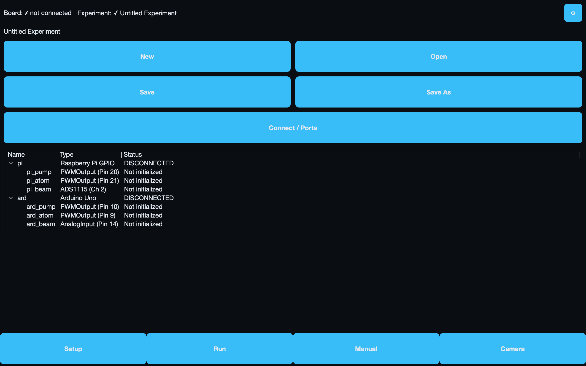

# The Runner Screen

The Runner screen is GLIDER's touchscreen layout. Everything happens on four
tabs behind a persistent bottom tab bar: **Setup**, **Run**, **Manual**, and
**Camera**. This page walks through each tab, the controls you'll find there,
and how to run an experiment start to finish without a keyboard.

## Getting oriented

Two elements are always available no matter which tab you're on:

- **The bottom tab bar.** A row of four large buttons — **Setup**, **Run**,
  **Manual**, **Camera** — pinned to the bottom of the screen. Tap one to switch
  tabs. The buttons are tall (sized for fingertips, not a mouse), and the
  current tab stays highlighted.
- **The run banner.** A slim strip that appears at the top of the screen while
  an experiment is live (running or paused) and you are on a tab *other than*
  Run. It carries the essentials with you so you never lose them: the elapsed
  **timer**, the current **state**, a **● REC** indicator when recording, and a
  **■ STOP** button. On the Run tab itself the banner is hidden, because the Run
  tab already shows all of that full-size.

!!! note "Where is the emergency stop?"
    There is deliberately no separate emergency-stop button in Runner mode. Use
    **STOP** (on the Run tab or in the run banner) to end a run. A full
    emergency-stop is a Desktop-mode menu action.

## The Setup tab

Setup is the landing tab and your home base between runs. It's a single
scrollable page with four parts, top to bottom.

<figure markdown="span">
  
  <figcaption>The Setup tab — status line up top, finger-sized file and connect buttons, the hardware roster, and the persistent bottom tab bar.</figcaption>
</figure>

### Status line

At the top, two short status readouts tell you whether you're ready to run:

- **Board:** either `✓` with the connected board's description, or
  `✗ not connected`.
- **Experiment:** either `✓` with the experiment's name, or `✗ none loaded`.

These refresh automatically about twice a second, so if you plug in a board or
open a file the status updates on its own — you don't have to reload anything.

### The housekeeping menu (⚙)

The gear button in the top-right corner opens a small menu with three items:

| Item | What it does |
| --- | --- |
| **Help** | Opens the in-app help. |
| **Switch to Desktop** | Leaves Runner mode for the full Desktop editor (see the caution below). |
| **Exit** | Closes GLIDER. |

!!! warning "Switching to Desktop is one-way"
    Once you switch to Desktop mode you cannot return to the Runner screen
    without restarting GLIDER. On a dedicated bench kiosk you normally leave this
    alone. See [Runner Mode](index.md#how-glider-chooses-runner-mode) for why.

### Experiment file actions

Below the experiment name is a grid of large buttons for working with
experiment files, plus a full-width connect button:

| Button | What it does |
| --- | --- |
| **New** | Start a fresh, empty experiment. |
| **Open** | Load an existing experiment file. |
| **Save** | Save the current experiment. |
| **Save As** | Save the current experiment under a new name. |
| **Connect / Ports** | Open the board/port settings to connect your hardware. |

An experiment is the node graph you built in Desktop mode — see
[Building Experiments](../building/index.md). In Runner mode you load and run
these files; you don't edit the graph.

### Hardware panel

The bottom of the Setup tab embeds the hardware panel, where connected devices
appear. Use **Connect / Ports** to open the port settings if your board isn't
showing up. For what the device types mean and how to wire them, see
[Devices & Hardware](../building/devices.md).

## The Run tab

The Run tab is where you start, watch, and stop a recorded experiment.

### Header

Across the top:

- **Experiment name** on the left (read-only here — set it when you build or
  save the experiment).
- A large **elapsed timer** in the middle, counting up while a run is live.
- A **state pill** on the right showing the current state (for example `IDLE`,
  `RUNNING`, `PAUSED`).

A **● REC** indicator appears while data is being recorded.

### Device status cards

The middle of the tab is a scrollable list of device cards, one per connected
device. Each card shows the device's name, its type, a live state readout, and a
**Ready** marker once the device is initialized. The readout depends on the
device:

- A digital output reads **HIGH** or **LOW**.
- An analog input shows its raw reading and the equivalent voltage (for example
  `512` / `2.50V`).
- Other devices show their current value.

If nothing is connected you'll see "Connect hardware to see devices."

### START and STOP

At the bottom are two big buttons:

- **▶ START** begins the experiment and starts recording. It is **enabled only
  when you're ready** — that means a board is connected *and* a runnable
  experiment is loaded. Until both are true, START is greyed out and a
  **"Not ready — check Setup"** hint appears; go back to the Setup tab to see
  which piece is missing.
- **■ STOP** ends the run at any time.

While a run is live the header timer hands off to the run banner, so the timer
keeps following you if you switch to another tab.

!!! tip "Stopping loads a clean time"
    When a flow finishes, the timer snaps to the experiment's true logical
    duration rather than the last timer tick, so repeated runs of the same flow
    report a consistent elapsed time.

## The Manual tab

The Manual tab lets you drive hardware by hand — turn an output on, nudge a
value, take a reading, or run a saved function — without starting a recorded
experiment. The controls here are **generated automatically** from whatever
devices are connected: GLIDER inspects each device's actions and builds the
right control for each one. That means custom and plugin devices get correct,
range-aware controls with no extra work.

!!! note "The Manual tab reflects your current hardware"
    Every time you open the Manual tab, its controls rebuild to match what's
    connected right now. If you connect a board from the Setup tab and then tap
    Manual, the new device's controls appear.

### Per-device controls

For each device you'll see a heading with the device's name, followed by one
control per action:

| Device action | Control you get |
| --- | --- |
| An on/off (switch) action | An **ON/OFF toggle** button. Tap to flip it. |
| A whole-number value (e.g. an angle, a duty cycle) | A **slider** paired with a **number box**. Drag the slider — the value only commits when you release, so the device doesn't ramp through every value in between — or type an exact number / nudge it by its step in the box. |
| A very large numeric range | Just the **number box** (a slider that fine would be unusable on a touchscreen). |
| An action that takes no value | A single **command button** that fires the action. |
| A readable measurement | A **Read** button with a value shown next to it. Tap Read to take a fresh reading. |

Redundant controls are folded away automatically: a digital output shows a
single ON/OFF switch (not separate On, Off, and Toggle buttons), and a value
output shows one slider rather than duplicate controls.

All values are clamped to each device's declared safe range before they're sent,
and commands to a single device are sent one at a time.

### The Functions section

If the loaded experiment defines any **functions** — reusable action sequences
built as a `StartFunction → … → EndFunction` chain in the graph — a
**Functions** section of large run buttons appears above the device controls.
Tap a button to run that function once against your hardware.

- While a function runs, its button is disabled and shows **"— Running…"**, so
  you can't accidentally start it twice.
- Some functions ask for a value first (for example, a number of revolutions).
  A prompt appears; enter the value to run, or cancel.
- If a function stops responding it is cancelled automatically and a notice
  appears in the status strip.

Functions are for manual, one-off actions between runs. They are gated so they
can never overlap a real experiment:

!!! warning "Functions can't run during an experiment"
    A manual function and a recorded experiment both drive the same hardware, so
    GLIDER refuses to start a function while an experiment is running or paused,
    and refuses to start one while another function is still running. You'll see
    a message like "Stop the experiment before running a function manually." You
    also need a board connected to run a function.

To learn how functions are built, see [Functions](../building/functions.md).

### The status strip

A status strip sits at the bottom of the Manual tab. Because a touchscreen
operator never sees the small status-bar messages a desktop user would, this
strip shows failures and warnings as an icon plus text and **keeps them visible
until something replaces them** — for example, if a command fails, if a value
had to be clamped, or if a function couldn't run. If you tap an ON/OFF switch and
the command fails, the switch flips back to its real state and the reason
appears here.

## The Camera tab

The Camera tab holds GLIDER's live camera view and recording controls in the
touchscreen layout. For how the camera, recording, and behavior tracking work,
see [Camera & Recording](../camera-behavior/camera.md) and
[Tracking](../camera-behavior/tracking.md).

## Running an experiment from the touchscreen

Here's the whole loop, tab by tab:

1. **Connect your hardware.** On the **Setup** tab, tap **Connect / Ports** and
   connect your board. The **Board** status line should turn to `✓`.
2. **Load your experiment.** Still on Setup, tap **Open** and choose your
   experiment file (or **New** to start fresh). The **Experiment** status line
   should turn to `✓`.
3. **(Optional) Check your rig by hand.** Tap **Manual** and use the
   auto-generated controls — toggle an output, nudge a value, take a reading, or
   run a Function — to confirm everything responds before you record.
4. **Start the run.** Tap **Run**. When both Board and Experiment are ready,
   **▶ START** lights up. Tap it. The timer begins, the state pill shows
   `RUNNING`, and **● REC** appears while recording.
5. **Watch it go.** Stay on the Run tab, or move to **Manual** or **Camera** —
   the run banner carries the timer, state, REC indicator, and **STOP** button
   with you.
6. **Stop when done.** Tap **■ STOP** (on the Run tab or in the banner). The run
   ends and the timer settles on the experiment's final duration.

!!! tip "First launch"
    The very first time GLIDER starts, it shows a short welcome dialog and tells
    you where your experiments and recordings will be saved. On a touchscreen the
    dialog simply offers **Start** and **Open User Guide** — tap **Start** to go
    straight to the Runner screen. (The interactive spotlight walkthrough,
    **Take the Tour**, is offered in Desktop mode, where it can point at the
    editor's panels.)
